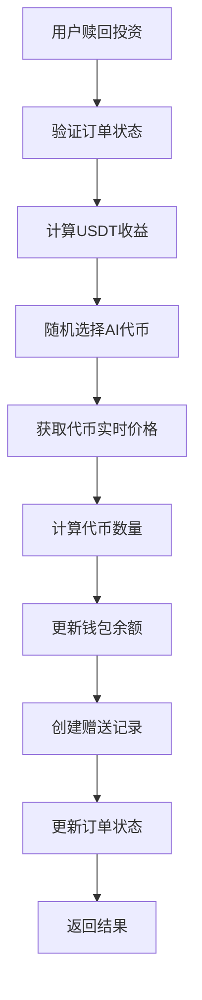

# AI代币系统实现文档

## 🎯 系统概述

AI代币系统是一个完整的代币赠送和管理解决方案，集成到现有的投资赎回流程中。每次用户赎回投资时，系统会随机赠送一种AI代币，增加用户参与感和趣味性。

## 🏗️ 系统架构

### 核心组件

1. **AI代币管理** (`api::ai-token.ai-token`)
   - 代币配置和元数据
   - 价格获取服务
   - 权重随机选择算法

2. **代币赠送记录** (`api::token-reward-record.token-reward-record`)
   - 记录每次代币赠送
   - 关联用户、订单和代币

3. **钱包余额扩展** (`api::qianbao-yue.qianbao-yue`)
   - 多代币余额管理
   - JSON格式存储代币余额

4. **投资订单集成** (`api::dinggou-dingdan.dinggou-dingdan`)
   - 赎回时自动赠送AI代币
   - 保持原有功能不变

## 🎲 代币配置

### 支持的代币

| 代币 | 符号 | 合约地址 | 价格源 | API ID | 权重 |
|------|------|----------|--------|--------|------|
| Render | RNDR | RNDR1A97ZatuqTAT2bZn1r4KwQisLvVfwJQfqWwaCSm | CoinGecko | render-token | 30 |
| Nosana | NOS | 4BC2PiK9Y319bPQKHbLbHu86xdksJLAuBTBDPc6QcKAS | CoinGecko | nosana | 25 |
| Synesis One | SNS | SNS5czn4ZyjtHNpgJyHCN33zBYFWvLJoYxx3JrqkjvGc | CoinGecko | synesis-one | 20 |
| Numeraire | NMR | NMR1gd2nautLcWTPZLY625YCHP6oVVNqs8s4ET3SkMsv | CoinGecko | numerai | 15 |
| ChainGPT | CGPT | CGPT1Ws3jh9E82fUmX9Zykp17fjM5pVp4SGbXw7U7Doo | CoinGecko | chaingpt | 10 |

### 权重随机选择算法

```javascript
weightedRandomSelect(tokens) {
  const totalWeight = tokens.reduce((sum, token) => sum + token.weight, 0);
  let random = Math.random() * totalWeight;
  
  for (const token of tokens) {
    random -= token.weight;
    if (random <= 0) {
      return token;
    }
  }
  
  return tokens[0];
}
```

## 🔌 价格获取服务

### 支持的价格源

1. **CoinGecko API**
   - 端点: `https://api.coingecko.com/api/v3/simple/price`
   - 支持: 大多数代币
   - 限制: 免费版有速率限制

2. **Binance API**
   - 端点: `https://api.binance.com/api/v3/ticker/price`
   - 支持: 币安上市代币
   - 优势: 实时性好

3. **DexScreener API**
   - 端点: `https://api.dexscreener.com/latest/dex/pairs/solana/`
   - 支持: Solana生态代币
   - 优势: 覆盖DEX价格

### 错误处理和降级

- 价格获取失败时使用默认价格 (0.01)
- 记录错误日志不影响主流程
- 支持批量价格获取和缓存

## 🔄 核心流程

### 投资赎回流程



### 详细步骤

1. **订单验证**
   - 检查订单存在性和状态
   - 验证赎回时间条件

2. **收益计算**
   - 按投资计划比例计算USDT收益
   - 计算AI代币USDT价值

3. **代币选择**
   - 获取所有活跃代币
   - 使用权重算法随机选择

4. **价格获取**
   - 根据配置的价格源获取实时价格
   - 处理API错误和超时

5. **余额更新**
   - 使用数据库事务确保原子性
   - 更新USDT和AI代币余额

6. **记录创建**
   - 创建代币赠送记录
   - 关联用户、订单和代币

## 📊 数据库设计

### AI代币表 (ai_tokens)

```sql
CREATE TABLE ai_tokens (
  id INT PRIMARY KEY AUTO_INCREMENT,
  name VARCHAR(100) NOT NULL UNIQUE,
  symbol VARCHAR(20) NOT NULL UNIQUE,
  contract_address VARCHAR(100),
  price_source ENUM('coingecko', 'binance', 'dexscreener') NOT NULL,
  price_api_id VARCHAR(100),
  weight INT DEFAULT 20 UNSIGNED,
  is_active BOOLEAN DEFAULT TRUE,
  logo_url VARCHAR(255),
  description TEXT,
  created_at TIMESTAMP DEFAULT CURRENT_TIMESTAMP,
  updated_at TIMESTAMP DEFAULT CURRENT_TIMESTAMP ON UPDATE CURRENT_TIMESTAMP
);
```

### 代币赠送记录表 (token_reward_records)

```sql
CREATE TABLE token_reward_records (
  id INT PRIMARY KEY AUTO_INCREMENT,
  user_id INT UNSIGNED NOT NULL,
  order_id INT UNSIGNED NOT NULL,
  token_id INT UNSIGNED NOT NULL,
  amount DECIMAL(20,8) NOT NULL,
  usdt_value DECIMAL(10,2) NOT NULL,
  token_price DECIMAL(10,8) NOT NULL,
  created_at TIMESTAMP DEFAULT CURRENT_TIMESTAMP,
  updated_at TIMESTAMP DEFAULT CURRENT_TIMESTAMP ON UPDATE CURRENT_TIMESTAMP,
  FOREIGN KEY (user_id) REFERENCES users-permissions_user(id) ON DELETE CASCADE,
  FOREIGN KEY (order_id) REFERENCES dinggou_dingdans(id) ON DELETE CASCADE,
  FOREIGN KEY (token_id) REFERENCES ai_tokens(id) ON DELETE CASCADE
);
```

### 钱包余额扩展 (qianbao_yues)

```sql
ALTER TABLE qianbao_yues ADD COLUMN ai_token_balances JSON DEFAULT '{}';
```

## 🔗 API接口

### AI代币接口

#### 获取活跃代币
```
GET /api/ai-tokens/active
Response: { success: true, data: [代币列表] }
```

#### 获取代币价格
```
GET /api/ai-tokens/:id/price
Response: { success: true, data: { price: 价格 } }
```

#### 批量获取价格
```
GET /api/ai-tokens/prices/batch
Response: { success: true, data: { tokenId: price } }
```

#### 初始化代币数据
```
POST /api/ai-tokens/initialize
Auth: Admin required
Response: { success: true, message: '初始化成功' }
```

### 钱包接口

#### 获取用户代币余额
```
GET /api/qianbao-yues/token-balances
Auth: User required
Response: { success: true, data: [代币余额列表] }
```

#### 获取用户代币赠送记录
```
GET /api/qianbao-yues/token-rewards
Auth: User required
Response: { success: true, data: [赠送记录列表] }
```

### 投资订单接口

#### 赎回订单（扩展）
```
POST /api/dinggou-dingdans/:id/redeem
Auth: User required
Response: { 
  success: true, 
  data: {
    orderId,
    staticUSDT,
    aiQty,
    selectedToken: {
      id, name, symbol, amount, usdtValue, price
    }
  }
}
```

## 🚀 部署指南

### 1. 环境准备

```bash
# 确保在strapi-backend-skeleton目录
cd strapi-backend-skeleton

# 安装依赖
npm install
```

### 2. 数据库迁移

```bash
# 运行迁移
npm run strapi database:migrate
```

### 3. 启动服务

```bash
# 开发模式
npm run develop

# 生产模式
npm run build
npm run start
```

### 4. 初始化代币数据

```bash
# 使用管理员token
curl -X POST http://localhost:1337/api/ai-tokens/initialize \
  -H "Authorization: Bearer YOUR_ADMIN_TOKEN"
```

### 5. 测试系统

```bash
# 运行测试脚本
node test-ai-token-system.js
```

## 🧪 测试指南

### 功能测试

1. **代币管理测试**
   - 获取活跃代币列表
   - 验证代币配置正确性

2. **价格获取测试**
   - 测试各价格源API
   - 验证错误处理机制

3. **随机选择测试**
   - 验证权重算法公平性
   - 统计选择分布

4. **赎回流程测试**
   - 测试完整赎回流程
   - 验证代币赠送功能

5. **余额管理测试**
   - 验证多代币余额更新
   - 测试余额查询功能

### 性能测试

1. **API响应时间**
   - 价格获取API < 2秒
   - 余额查询API < 1秒

2. **并发处理**
   - 支持多用户同时赎回
   - 数据库事务隔离

3. **错误恢复**
   - 价格API失败时的降级
   - 数据库连接异常处理

## 🔧 配置管理

### 环境变量

```env
# 价格API配置
COINGECKO_API_KEY=your_api_key
BINANCE_API_KEY=your_api_key

# 代币配置
DEFAULT_TOKEN_PRICE=0.01
PRICE_CACHE_TTL=300
```

### 代币权重调整

```javascript
// 在ai-token服务中修改权重
const tokens = [
  { name: 'Render', weight: 30 },    // 30% 概率
  { name: 'Nosana', weight: 25 },    // 25% 概率
  { name: 'Synesis One', weight: 20 }, // 20% 概率
  { name: 'Numeraire', weight: 15 }, // 15% 概率
  { name: 'ChainGPT', weight: 10 }   // 10% 概率
];
```

## 📈 监控和维护

### 日志监控

- 价格获取失败日志
- 代币赠送记录
- 系统错误日志

### 性能指标

- API响应时间
- 价格获取成功率
- 代币选择分布

### 维护任务

- 定期更新代币价格源
- 清理过期赠送记录
- 优化数据库查询

## 🔮 未来扩展

### 功能扩展

1. **更多代币支持**
   - 添加新的AI代币
   - 支持更多价格源

2. **高级功能**
   - 代币交易功能
   - 价格预警系统
   - 代币组合推荐

3. **用户体验**
   - 代币图标和描述
   - 价格走势图表
   - 代币价值统计

### 技术优化

1. **性能优化**
   - Redis价格缓存
   - 数据库索引优化
   - API限流处理

2. **可靠性提升**
   - 多价格源备份
   - 自动故障转移
   - 数据备份策略

## 📞 技术支持

如有问题或建议，请联系开发团队。

---

**版本**: 1.0.0  
**最后更新**: 2024年1月  
**维护者**: AI代币系统开发团队 