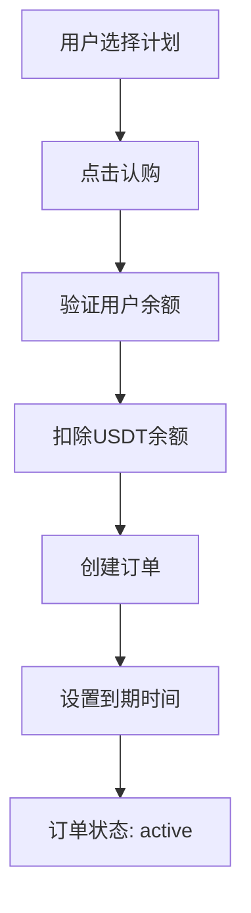
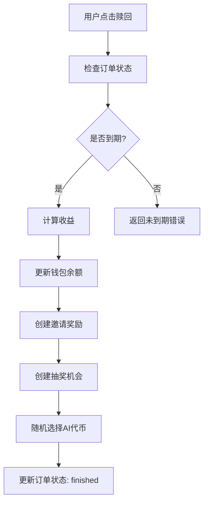

# 后端认购计划完整对接文档

## 📋 系统概述

认购计划系统是一个完整的投资理财模块，包含以下核心功能：
- **认购计划管理**: 创建和管理不同档位的投资计划
- **订单管理**: 用户购买计划、订单状态跟踪
- **收益计算**: 静态收益和AI代币收益计算
- **钱包管理**: USDT和AI代币余额管理
- **奖励系统**: 邀请奖励、抽奖机会、代币奖励

## 🏗️ 数据模型

### 1. 认购计划 (dinggou-jihua)

**Schema定义**:
```typescript
{
  jihuaCode   : { type: 'string',  required: true, unique: true },   // 计划代码
  benjinUSDT  : { type: 'string', required: true, default: '0' },    // 本金USDT
  zhouQiTian  : { type: 'integer', required: true, default: 15 },    // 周期天数
  jingtaiBili : { type: 'string', required: true, default: '0' },    // 静态比例%
  aiBili      : { type: 'string', required: true, default: '0' },    // AI比例%
  choujiangCi : { type: 'integer',  default: 3 },                    // 抽奖次数
  kaiqi       : { type: 'boolean',  default: true },                 // 是否开启
  dingdanList : { type: 'relation', relation: 'oneToMany',           // 关联订单
                  target: 'api::dinggou-dingdan.dinggou-dingdan', mappedBy: 'jihua' },
}
```

**示例数据**:
```json
{
  "id": 1,
  "jihuaCode": "PLAN500",
  "benjinUSDT": "500",
  "zhouQiTian": 15,
  "jingtaiBili": "6",
  "aiBili": "3",
  "choujiangCi": 3,
  "kaiqi": true
}
```

### 2. 认购订单 (dinggou-dingdan)

**Schema定义**:
```typescript
{
  benjinUSDT    : { type: 'string', required: true },                // 本金USDT
  zhuangtai     : { type: 'enumeration', enum: ['active','redeemable','finished'], default: 'active' },
  kaishiShiJian : { type: 'datetime', required: true },              // 开始时间
  jieshuShiJian : { type: 'datetime', required: true },              // 结束时间
  jingtaiShouyi : { type: 'string', default: '0' },                  // 静态收益
  aiShuliang    : { type: 'string', default: '0' },                  // AI数量
  yonghu        : { type: 'relation', relation: 'manyToOne',         // 关联用户
                    target: 'plugin::users-permissions.user', inversedBy: 'dinggouOrders' },
  jihua         : { type: 'relation', relation: 'manyToOne',         // 关联计划
                    target: 'api::dinggou-jihua.dinggou-jihua', inversedBy: 'dingdanList' },
  jiangli       : { type: 'relation', relation: 'oneToOne',          // 关联奖励
                    target: 'api::yaoqing-jiangli.yaoqing-jiangli' },
}
```

**订单状态说明**:
- `active`: 进行中，未到期
- `redeemable`: 可赎回，已到期
- `finished`: 已完成，已赎回

### 3. 钱包余额 (qianbao-yue)

**Schema定义**:
```typescript
{
  usdtYue : { type: 'string', default: '0' },                        // USDT余额
  aiYue   : { type: 'string', default: '0' },                        // AI余额
  aiTokenBalances: { 
    type: 'json', 
    default: '{}',
    description: 'AI代币余额JSON格式 {tokenId: balance}'
  },
  yonghu  : { type: 'relation', relation: 'oneToOne',                // 关联用户
              target: 'plugin::users-permissions.user', inversedBy: 'qianbao' },
}
```

### 4. AI代币 (ai-token)

**Schema定义**:
```typescript
{
  name: { type: 'string', required: true, unique: true, maxLength: 100 },
  symbol: { type: 'string', required: true, unique: true, maxLength: 20 },
  contractAddress: { type: 'string', maxLength: 100 },               // 合约地址
  priceSource: { 
    type: 'enumeration',
    enum: ['coingecko', 'binance', 'dexscreener'],
    required: true
  },
  priceApiId: { type: 'string', maxLength: 100 },                    // API代币ID
  weight: { type: 'integer', default: 20, min: 1, max: 100 },        // 权重
  isActive: { type: 'boolean', default: true },                      // 是否启用
  logoUrl: { type: 'string', maxLength: 255 },                       // 图标URL
  description: { type: 'text' },                                     // 描述
}
```

## 🔌 API接口

### 1. 认购计划接口

#### 1.1 获取认购计划列表
```http
GET /api/dinggou-jihuas?filters[kaiqi]=true
```

**响应示例**:
```json
{
  "data": [
    {
      "id": 1,
      "attributes": {
        "jihuaCode": "PLAN500",
        "benjinUSDT": "500",
        "zhouQiTian": 15,
        "jingtaiBili": "6",
        "aiBili": "3",
        "choujiangCi": 3,
        "kaiqi": true
      }
    }
  ],
  "meta": {
    "pagination": {
      "page": 1,
      "pageSize": 25,
      "pageCount": 1,
      "total": 1
    }
  }
}
```

#### 1.2 获取单个认购计划
```http
GET /api/dinggou-jihuas/:id
```

#### 1.3 创建认购计划 (管理员)
```http
POST /api/dinggou-jihuas
Content-Type: application/json

{
  "data": {
    "jihuaCode": "PLAN500",
    "benjinUSDT": "500",
    "zhouQiTian": 15,
    "jingtaiBili": "6",
    "aiBili": "3",
    "choujiangCi": 3,
    "kaiqi": true
  }
}
```

### 2. 认购订单接口

#### 2.1 创建认购订单
```http
POST /api/dinggou-dingdans
Content-Type: application/json
Authorization: Bearer <user_token>

{
  "data": {
    "jihuaId": 1
  }
}
```

**响应示例**:
```json
{
  "success": true,
  "data": {
    "id": 1,
    "benjinUSDT": "500",
    "zhuangtai": "active",
    "kaishiShiJian": "2024-01-01T00:00:00.000Z",
    "jieshuShiJian": "2024-01-16T00:00:00.000Z",
    "yonghu": 1,
    "jihua": 1
  }
}
```

#### 2.2 获取用户订单列表
```http
GET /api/dinggou-dingdans?filters[yonghu][$eq]=1&populate=jihua
```

#### 2.3 赎回订单
```http
POST /api/dinggou-dingdans/:id/redeem
Content-Type: application/json
Authorization: Bearer <user_token>

{
  "force": false,
  "testMode": false
}
```

**响应示例**:
```json
{
  "success": true,
  "data": {
    "orderId": 1,
    "benjinUSDT": "500",
    "staticUSDT": "30.00",
    "aiQty": "15.00000000",
    "selectedToken": {
      "id": 1,
      "name": "AI Token",
      "symbol": "AIT",
      "amount": "15.00000000",
      "usdtValue": "15.00",
      "price": "1.00000000"
    },
    "isExpired": true,
    "startTime": "2024-01-01T00:00:00.000Z",
    "endTime": "2024-01-16T00:00:00.000Z",
    "currentTime": "2024-01-16T12:00:00.000Z"
  }
}
```

### 3. 钱包余额接口

#### 3.1 获取用户钱包余额
```http
GET /api/qianbao-yues?filters[yonghu][$eq]=1
```

**响应示例**:
```json
{
  "data": [
    {
      "id": 1,
      "attributes": {
        "usdtYue": "1000.00",
        "aiYue": "50.00000000",
        "aiTokenBalances": {
          "1": "10.00000000",
          "2": "5.00000000"
        }
      }
    }
  ]
}
```

### 4. AI代币接口

#### 4.1 获取AI代币列表
```http
GET /api/ai-tokens?filters[isActive][$eq]=true
```

**响应示例**:
```json
{
  "data": [
    {
      "id": 1,
      "attributes": {
        "name": "AI Token",
        "symbol": "AIT",
        "contractAddress": "0x...",
        "priceSource": "coingecko",
        "priceApiId": "ai-token",
        "weight": 20,
        "isActive": true,
        "logoUrl": "https://...",
        "description": "AI代币描述"
      }
    }
  ]
}
```

## 🔄 业务流程

### 1. 认购流程



### 2. 赎回流程



### 3. 收益计算规则

#### 3.1 静态收益计算
```
静态收益 = 本金 × 静态比例% × 实际天数 / 总天数
```

#### 3.2 AI代币收益计算
```
AI代币数量 = 本金 × AI比例% / AI代币价格
```

#### 3.3 未到期赎回比例计算
```
实际比例 = 已过时间 / 总时间
实际收益 = 预期收益 × 实际比例
```

## 🎯 前端对接要点

### 1. 页面结构建议

#### 1.1 认购计划列表页
- 显示所有开启的计划
- 每个计划显示：本金、周期、收益率、抽奖次数
- 点击进入认购确认页

#### 1.2 认购确认页
- 显示计划详情
- 显示用户当前余额
- 确认认购按钮

#### 1.3 我的订单页
- 显示用户所有订单
- 订单状态：进行中/可赎回/已完成
- 显示剩余时间和收益预估

#### 1.4 订单详情页
- 显示订单完整信息
- 赎回按钮（仅可赎回状态）
- 收益明细

### 2. 关键API调用

#### 2.1 获取计划列表
```dart
final response = await _httpClient.dio.get('/api/dinggou-jihuas?filters[kaiqi]=true');
```

#### 2.2 创建订单
```dart
final response = await _httpClient.dio.post('/api/dinggou-dingdans', data: {
  'data': {
    'jihuaId': planId
  }
});
```

#### 2.3 获取用户订单
```dart
final response = await _httpClient.dio.get('/api/dinggou-dingdans?filters[yonghu][\$eq]=$userId&populate=jihua');
```

#### 2.4 赎回订单
```dart
final response = await _httpClient.dio.post('/api/dinggou-dingdans/$orderId/redeem', data: {
  'force': false
});
```

### 3. 状态管理

#### 3.1 订单状态映射
```dart
enum OrderStatus {
  active,      // 进行中
  redeemable,  // 可赎回
  finished     // 已完成
}
```

#### 3.2 时间计算
```dart
// 计算剩余时间
DateTime endTime = DateTime.parse(order['jieshuShiJian']);
DateTime now = DateTime.now();
Duration remaining = endTime.difference(now);
```

### 4. 错误处理

#### 4.1 常见错误码
- `400`: 余额不足、订单未到期、计划不存在
- `401`: 用户未登录
- `403`: 无权操作
- `404`: 订单不存在

#### 4.2 错误消息
- "余额不足"
- "订单尚未到期，还需等待 X 天"
- "该投资计划已关闭"
- "订单状态不允许赎回"

## 🧪 测试数据

### 1. 测试计划数据
```json
[
  {
    "jihuaCode": "PLAN500",
    "benjinUSDT": "500",
    "zhouQiTian": 15,
    "jingtaiBili": "6",
    "aiBili": "3",
    "choujiangCi": 3,
    "kaiqi": true
  },
  {
    "jihuaCode": "PLAN1000",
    "benjinUSDT": "1000",
    "zhouQiTian": 20,
    "jingtaiBili": "7",
    "aiBili": "4",
    "choujiangCi": 5,
    "kaiqi": true
  },
  {
    "jihuaCode": "PLAN3000",
    "benjinUSDT": "3000",
    "zhouQiTian": 25,
    "jingtaiBili": "8",
    "aiBili": "5",
    "choujiangCi": 8,
    "kaiqi": true
  },
  {
    "jihuaCode": "PLAN5000",
    "benjinUSDT": "5000",
    "zhouQiTian": 30,
    "jingtaiBili": "9",
    "aiBili": "6",
    "choujiangCi": 12,
    "kaiqi": true
  }
]
```

### 2. 测试命令
```bash
# 获取计划列表
curl -X GET "http://118.107.4.158:1337/api/dinggou-jihuas?filters[kaiqi]=true"

# 创建订单
curl -X POST "http://118.107.4.158:1337/api/dinggou-dingdans" \
  -H "Content-Type: application/json" \
  -H "Authorization: Bearer YOUR_TOKEN" \
  -d '{"data":{"jihuaId":1}}'

# 赎回订单
curl -X POST "http://118.107.4.158:1337/api/dinggou-dingdans/1/redeem" \
  -H "Content-Type: application/json" \
  -H "Authorization: Bearer YOUR_TOKEN" \
  -d '{"force":false}'
```

## 📝 注意事项

1. **认证要求**: 所有订单相关接口都需要用户登录
2. **余额检查**: 创建订单前会自动检查用户余额
3. **时间计算**: 赎回时会自动计算实际收益
4. **事务处理**: 所有资金操作都使用数据库事务确保一致性
5. **错误处理**: 详细的错误消息帮助用户理解问题
6. **状态管理**: 订单状态自动流转，无需手动更新

---
*文档版本: v1.0*
*更新时间: 2024年1月1日* 