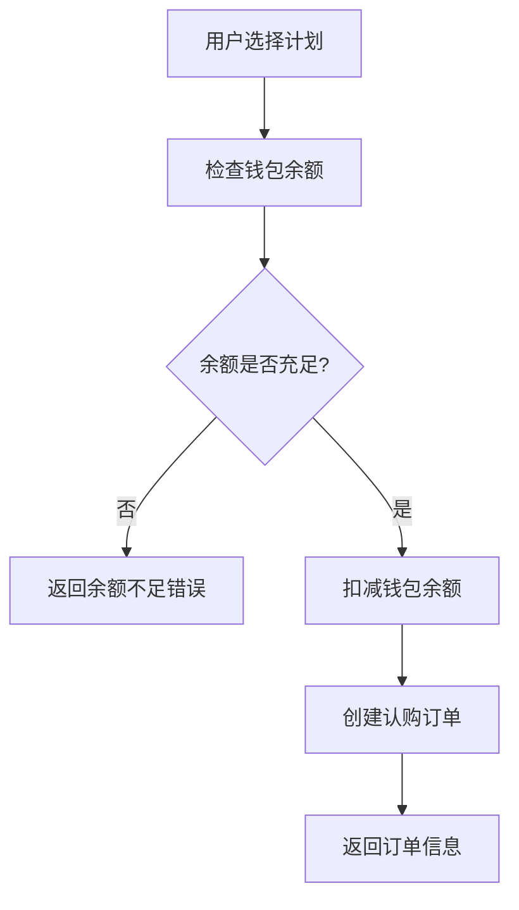
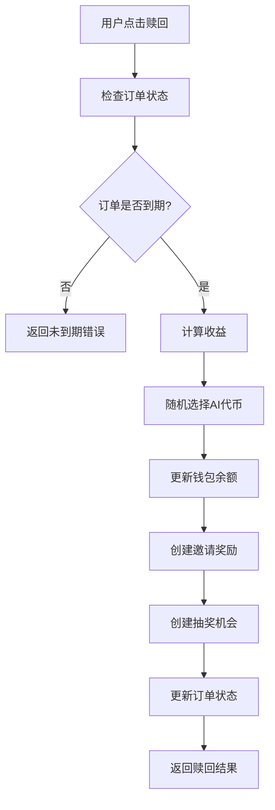

# 认购板块对接总结

## 📋 后端代码排查完成情况

### ✅ 已排查的核心模块

#### 1. 认购计划模块 (dinggou-jihua)
- **数据模型**: 包含计划代码、本金、周期、收益比例等字段
- **API接口**: 标准的CRUD操作，支持筛选开启的计划
- **业务逻辑**: 管理员可创建和管理不同的投资计划

#### 2. 认购订单模块 (dinggou-dingdan)
- **数据模型**: 包含订单状态、时间、收益等字段
- **核心功能**: 
  - `createOrder()`: 创建订单并扣减钱包余额
  - `redeem()`: 赎回订单并计算收益
- **业务逻辑**: 完整的订单生命周期管理

#### 3. 钱包余额模块 (qianbao-yue)
- **数据模型**: USDT余额、AI代币余额、代币余额JSON
- **业务逻辑**: 支持多种代币余额管理

#### 4. AI代币模块 (ai-token)
- **数据模型**: 代币信息、价格源、权重等
- **业务逻辑**: 支持随机选择代币和价格获取

#### 5. 邀请奖励模块 (yaoqing-jiangli)
- **数据模型**: 奖励金额、推荐关系
- **业务逻辑**: 基于推荐关系发放奖励

#### 6. 抽奖机会模块 (choujiang-jihui)
- **数据模型**: 抽奖次数、状态、到期时间
- **业务逻辑**: 投资到期后获得抽奖机会

#### 7. 代币奖励记录模块 (token-reward-record)
- **数据模型**: 代币赠送记录
- **业务逻辑**: 记录AI代币赠送历史

## 🔄 业务流程分析

### 1. 认购流程


### 2. 赎回流程


## 📊 数据模型总结

### 核心实体关系
```
用户 (User)
├── 钱包余额 (QianbaoYue) - 1:1
├── 认购订单 (DinggouDingdan) - 1:N
└── 邀请奖励 (YaoqingJiangli) - 1:N

认购计划 (DinggouJihua)
└── 认购订单 (DinggouDingdan) - 1:N

AI代币 (AiToken)
└── 代币奖励记录 (TokenRewardRecord) - 1:N

认购订单 (DinggouDingdan)
├── 邀请奖励 (YaoqingJiangli) - 1:1
├── 抽奖机会 (ChoujiangJihui) - 1:N
└── 代币奖励记录 (TokenRewardRecord) - 1:N
```

### 关键字段说明
- **订单状态**: `active`(进行中) → `redeemable`(可赎回) → `finished`(已完成)
- **收益计算**: 静态收益 + AI代币 + 抽奖机会 + 邀请奖励
- **时间管理**: 开始时间、结束时间、到期检查
- **余额管理**: 事务处理确保数据一致性

## 🚀 API接口总结

### 核心接口
1. **GET /api/dinggou-jihuas** - 获取认购计划列表
2. **GET /api/dinggou-jihuas/:id** - 获取计划详情
3. **POST /api/dinggou-dingdans** - 创建认购订单
4. **GET /api/dinggou-dingdans** - 获取用户订单列表
5. **POST /api/dinggou-dingdans/:id/redeem** - 赎回订单
6. **GET /api/qianbao-yues** - 获取钱包余额
7. **GET /api/ai-tokens** - 获取AI代币列表

### 认证要求
- 创建订单、获取订单、赎回订单需要JWT Token
- 钱包余额查询需要用户认证

## 📝 已生成的文档

### 1. 完整对接文档
- **文件**: `认购板块对接文档.md`
- **内容**: 
  - 系统概述和业务流程
  - 详细的数据模型定义
  - 完整的API接口文档
  - Flutter/Dart集成示例
  - 错误处理和测试用例

### 2. 快速对接指南
- **文件**: `认购板块快速对接指南.md`
- **内容**:
  - 核心API接口速查
  - 关键数据字段说明
  - Flutter集成要点
  - 快速测试命令

## 🎯 前端重构建议

### 1. 页面结构建议
```
认购板块/
├── 认购计划页面 (SubscriptionPlansPage)
├── 计划详情页面 (PlanDetailPage)
├── 订单列表页面 (OrderListPage)
├── 订单详情页面 (OrderDetailPage)
├── 钱包页面 (WalletPage)
└── 收益记录页面 (RewardHistoryPage)
```

### 2. 服务层建议
```dart
// 认购服务
class SubscriptionService {
  Future<Map<String, dynamic>> getPlans();
  Future<Map<String, dynamic>> createOrder(int planId);
  Future<Map<String, dynamic>> getOrders();
  Future<Map<String, dynamic>> redeemOrder(int orderId);
}

// 钱包服务
class WalletService {
  Future<Map<String, dynamic>> getBalance();
  Future<Map<String, dynamic>> getTransactions();
}

// AI代币服务
class AiTokenService {
  Future<Map<String, dynamic>> getTokens();
  Future<Map<String, dynamic>> getTokenPrice(int tokenId);
}
```

### 3. 数据模型建议
```dart
// 认购计划模型
class SubscriptionPlan {
  final int id;
  final String planCode;
  final String principalAmount;
  final int cycleDays;
  final String staticRate;
  final String aiRate;
  final int lotteryCount;
  final bool isEnabled;
}

// 订单模型
class SubscriptionOrder {
  final int id;
  final String principalAmount;
  final String status;
  final DateTime startTime;
  final DateTime endTime;
  final String staticProfit;
  final String aiAmount;
  final SubscriptionPlan plan;
}

// 钱包模型
class Wallet {
  final String usdtBalance;
  final String aiBalance;
  final Map<String, String> tokenBalances;
}
```

## ⚠️ 重要注意事项

### 1. 业务规则
- 用户必须有足够USDT余额才能创建订单
- 订单到期前不能赎回（除非强制赎回）
- 赎回时会自动计算收益并更新钱包余额
- 赎回成功后会创建邀请奖励和抽奖机会

### 2. 技术考虑
- 使用数据库事务确保数据一致性
- 异步处理邀请奖励和抽奖机会创建
- 合理使用populate减少数据库查询
- 缓存AI代币价格信息

### 3. 安全考虑
- 所有订单操作都需要用户认证
- 用户只能操作自己的订单
- 防止重复赎回和余额异常
- 输入验证和错误处理

## 🚀 下一步计划

### 1. 前端开发任务
- [ ] 创建认购计划页面
- [ ] 创建订单列表页面
- [ ] 创建订单详情页面
- [ ] 集成钱包余额显示
- [ ] 实现订单赎回功能
- [ ] 添加收益记录页面

### 2. 功能优化
- [ ] 添加订单状态实时更新
- [ ] 实现倒计时显示
- [ ] 添加收益计算器
- [ ] 优化页面加载性能
- [ ] 添加错误重试机制

### 3. 用户体验
- [ ] 添加加载动画
- [ ] 优化错误提示
- [ ] 添加确认对话框
- [ ] 实现下拉刷新
- [ ] 添加分页加载

## 📞 技术支持

### 相关文档
1. **完整对接文档**: `认购板块对接文档.md`
2. **快速对接指南**: `认购板块快速对接指南.md`
3. **API文档**: `http://118.107.4.158:1337/api/documentation`
4. **登录注册文档**: `前端登录注册对接文档.md`

### 测试资源
- **测试服务器**: `http://118.107.4.158:1337`
- **测试账号**: 使用登录注册功能创建的账号
- **测试计划**: 后端已配置的认购计划

---

*总结完成时间: 2024年1月1日* 