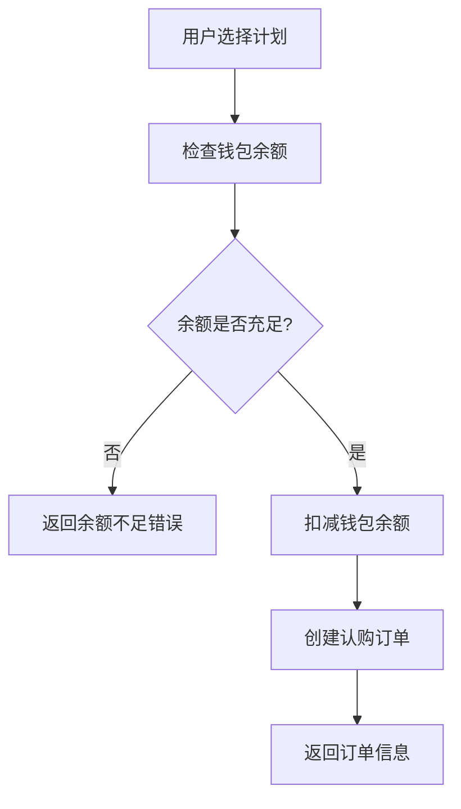
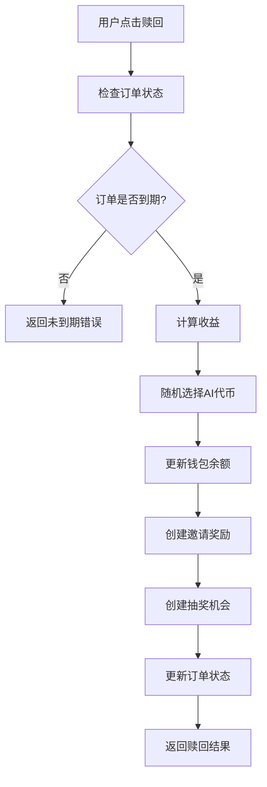

# 认购板块对接文档

## 📋 系统概述

认购板块是一个完整的投资理财系统，包含以下核心功能：
- **认购计划管理**: 管理员创建不同的投资计划
- **订单创建**: 用户选择计划进行投资
- **收益计算**: 到期后自动计算静态收益和AI代币奖励
- **邀请奖励**: 基于推荐关系发放奖励
- **抽奖机会**: 投资到期后获得抽奖机会

## 🔗 API 基础信息

- **Base URL**: `http://118.107.4.158:1337`
- **认证方式**: JWT Bearer Token
- **Content-Type**: `application/json`

## 📊 数据模型

### 1. 认购计划 (dinggou-jihua)

```typescript
interface DinggouJihua {
  id: number;
  jihuaCode: string;        // 计划代码，如 "PLAN500"
  benjinUSDT: string;       // 本金金额，如 "500"
  zhouQiTian: number;       // 周期天数，如 15
  jingtaiBili: string;      // 静态收益比例，如 "6"
  aiBili: string;          // AI代币比例，如 "3"
  choujiangCi: number;     // 抽奖次数，如 3
  kaiqi: boolean;          // 是否开启
  dingdanList?: DinggouDingdan[]; // 关联订单列表
  createdAt: string;
  updatedAt: string;
}
```

### 2. 认购订单 (dinggou-dingdan)

```typescript
interface DinggouDingdan {
  id: number;
  benjinUSDT: string;       // 本金金额
  zhuangtai: 'active' | 'redeemable' | 'finished'; // 订单状态
  kaishiShiJian: string;    // 开始时间
  jieshuShiJian: string;    // 结束时间
  jingtaiShouyi: string;    // 静态收益
  aiShuliang: string;       // AI代币数量
  yonghu: User;             // 关联用户
  jihua: DinggouJihua;      // 关联计划
  jiangli?: YaoqingJiangli; // 关联奖励
  createdAt: string;
  updatedAt: string;
}
```

### 3. 钱包余额 (qianbao-yue)

```typescript
interface QianbaoYue {
  id: number;
  usdtYue: string;          // USDT余额
  aiYue: string;            // AI代币余额
  aiTokenBalances: string;  // AI代币余额JSON格式
  yonghu: User;             // 关联用户
  createdAt: string;
  updatedAt: string;
}
```

### 4. AI代币 (ai-token)

```typescript
interface AiToken {
  id: number;
  name: string;             // 代币名称
  symbol: string;           // 代币符号
  contractAddress?: string; // 合约地址
  priceSource: 'coingecko' | 'binance' | 'dexscreener';
  priceApiId?: string;      // API中的代币ID
  weight: number;           // 权重(1-100)
  isActive: boolean;        // 是否启用
  logoUrl?: string;         // 代币图标URL
  description?: string;     // 代币描述
  createdAt: string;
  updatedAt: string;
}
```

## 🚀 API 接口详情

### 1. 获取认购计划列表

**接口**: `GET /api/dinggou-jihuas`

**描述**: 获取所有可用的认购计划

**请求参数**:
```typescript
{
  filters?: {
    kaiqi?: boolean;        // 筛选开启的计划
  };
  sort?: string;            // 排序，如 "createdAt:desc"
  pagination?: {
    page?: number;          // 页码
    pageSize?: number;      // 每页数量
  };
}
```

**响应示例**:
```json
{
  "data": [
    {
      "id": 1,
      "attributes": {
        "jihuaCode": "PLAN500",
        "benjinUSDT": "500",
        "zhouQiTian": 15,
        "jingtaiBili": "6",
        "aiBili": "3",
        "choujiangCi": 3,
        "kaiqi": true,
        "createdAt": "2024-01-01T00:00:00.000Z",
        "updatedAt": "2024-01-01T00:00:00.000Z"
      }
    }
  ],
  "meta": {
    "pagination": {
      "page": 1,
      "pageSize": 25,
      "pageCount": 1,
      "total": 1
    }
  }
}
```

### 2. 获取认购计划详情

**接口**: `GET /api/dinggou-jihuas/:id`

**描述**: 获取指定认购计划的详细信息

**响应示例**:
```json
{
  "data": {
    "id": 1,
    "attributes": {
      "jihuaCode": "PLAN500",
      "benjinUSDT": "500",
      "zhouQiTian": 15,
      "jingtaiBili": "6",
      "aiBili": "3",
      "choujiangCi": 3,
      "kaiqi": true,
      "createdAt": "2024-01-01T00:00:00.000Z",
      "updatedAt": "2024-01-01T00:00:00.000Z"
    }
  }
}
```

### 3. 创建认购订单

**接口**: `POST /api/dinggou-dingdans`

**描述**: 用户选择计划创建认购订单

**认证**: 需要JWT Token

**请求体**:
```json
{
  "data": {
    "jihuaId": 1
  }
}
```

**响应示例**:
```json
{
  "success": true,
  "data": {
    "id": 1,
    "attributes": {
      "benjinUSDT": "500",
      "zhuangtai": "active",
      "kaishiShiJian": "2024-01-01T00:00:00.000Z",
      "jieshuShiJian": "2024-01-16T00:00:00.000Z",
      "jingtaiShouyi": "0",
      "aiShuliang": "0",
      "createdAt": "2024-01-01T00:00:00.000Z",
      "updatedAt": "2024-01-01T00:00:00.000Z"
    }
  }
}
```

**错误响应**:
```json
{
  "error": {
    "status": 400,
    "name": "BadRequestError",
    "message": "余额不足"
  }
}
```

### 4. 获取用户订单列表

**接口**: `GET /api/dinggou-dingdans`

**描述**: 获取当前用户的认购订单列表

**认证**: 需要JWT Token

**请求参数**:
```typescript
{
  filters?: {
    zhuangtai?: 'active' | 'redeemable' | 'finished';
    yonghu?: number;        // 用户ID
  };
  sort?: string;            // 排序，如 "createdAt:desc"
  pagination?: {
    page?: number;
    pageSize?: number;
  };
  populate?: string[];      // 关联数据，如 ["jihua", "yonghu"]
}
```

**响应示例**:
```json
{
  "data": [
    {
      "id": 1,
      "attributes": {
        "benjinUSDT": "500",
        "zhuangtai": "active",
        "kaishiShiJian": "2024-01-01T00:00:00.000Z",
        "jieshuShiJian": "2024-01-16T00:00:00.000Z",
        "jingtaiShouyi": "0",
        "aiShuliang": "0",
        "createdAt": "2024-01-01T00:00:00.000Z",
        "updatedAt": "2024-01-01T00:00:00.000Z",
        "jihua": {
          "data": {
            "id": 1,
            "attributes": {
              "jihuaCode": "PLAN500",
              "benjinUSDT": "500",
              "zhouQiTian": 15,
              "jingtaiBili": "6",
              "aiBili": "3"
            }
          }
        }
      }
    }
  ],
  "meta": {
    "pagination": {
      "page": 1,
      "pageSize": 25,
      "pageCount": 1,
      "total": 1
    }
  }
}
```

### 5. 赎回订单

**接口**: `POST /api/dinggou-dingdans/:id/redeem`

**描述**: 赎回已到期的认购订单

**认证**: 需要JWT Token

**请求体**:
```json
{
  "force": false,           // 是否强制赎回
  "testMode": false         // 是否测试模式
}
```

**响应示例**:
```json
{
  "success": true,
  "data": {
    "orderId": 1,
    "benjinUSDT": "500",
    "staticUSDT": "30.00",
    "aiQty": "15.00000000",
    "selectedToken": {
      "id": 1,
      "name": "AI Token",
      "symbol": "AIT",
      "amount": "150.00000000",
      "usdtValue": "15.00",
      "price": "0.10000000"
    },
    "isExpired": true,
    "force": false,
    "testMode": false,
    "startTime": "2024-01-01T00:00:00.000Z",
    "endTime": "2024-01-16T00:00:00.000Z",
    "currentTime": "2024-01-16T00:00:00.000Z"
  }
}
```

**错误响应**:
```json
{
  "error": {
    "status": 400,
    "name": "BadRequestError",
    "message": "订单尚未到期，还需等待 5 天"
  }
}
```

### 6. 获取钱包余额

**接口**: `GET /api/qianbao-yues`

**描述**: 获取当前用户的钱包余额

**认证**: 需要JWT Token

**请求参数**:
```typescript
{
  filters: {
    yonghu: number;         // 用户ID
  };
  populate?: string[];      // 关联数据
}
```

**响应示例**:
```json
{
  "data": [
    {
      "id": 1,
      "attributes": {
        "usdtYue": "1000.00",
        "aiYue": "50.00000000",
        "aiTokenBalances": "{\"1\":\"100.00000000\",\"2\":\"200.00000000\"}",
        "createdAt": "2024-01-01T00:00:00.000Z",
        "updatedAt": "2024-01-01T00:00:00.000Z"
      }
    }
  ]
}
```

### 7. 获取AI代币列表

**接口**: `GET /api/ai-tokens`

**描述**: 获取所有AI代币信息

**请求参数**:
```typescript
{
  filters?: {
    isActive?: boolean;     // 筛选启用的代币
  };
  sort?: string;            // 排序
}
```

**响应示例**:
```json
{
  "data": [
    {
      "id": 1,
      "attributes": {
        "name": "AI Token",
        "symbol": "AIT",
        "contractAddress": "0x123...",
        "priceSource": "coingecko",
        "priceApiId": "ai-token",
        "weight": 20,
        "isActive": true,
        "logoUrl": "https://example.com/logo.png",
        "description": "AI代币描述",
        "createdAt": "2024-01-01T00:00:00.000Z",
        "updatedAt": "2024-01-01T00:00:00.000Z"
      }
    }
  ]
}
```

## 🔄 业务流程

### 1. 认购流程



### 2. 赎回流程



### 3. 收益计算规则

#### 静态收益计算
```
静态收益 = 本金 × 静态收益比例 / 100
例如: 500 × 6 / 100 = 30 USDT
```

#### AI代币计算
```
AI代币数量 = 本金 × AI代币比例 / 100
例如: 500 × 3 / 100 = 15 AI代币
```

#### 未到期赎回计算
```
实际收益 = 标准收益 × (实际时间 / 总时间)
```

## 🎯 前端集成指南

### 1. Flutter/Dart 集成示例

#### 认购计划服务
```dart
class SubscriptionService {
  final HttpClient _httpClient = HttpClient();

  // 获取认购计划列表
  Future<Map<String, dynamic>> getSubscriptionPlans({bool? enabled}) async {
    try {
      _httpClient.init();
      final queryParams = <String, dynamic>{};
      if (enabled != null) {
        queryParams['filters[kaiqi]'] = enabled;
      }
      
      final response = await _httpClient.dio.get('/api/dinggou-jihuas', 
        queryParameters: queryParams);
      
      if (response.statusCode == 200) {
        return {'success': true, 'data': response.data};
      }
      return {'success': false, 'message': '获取认购计划失败'};
    } on DioException catch (e) {
      return {'success': false, 'message': e.response?.data?['error']?['message'] ?? '网络错误'};
    } catch (e) {
      return {'success': false, 'message': '未知错误: $e'};
    }
  }

  // 创建认购订单
  Future<Map<String, dynamic>> createSubscriptionOrder({
    required int planId,
  }) async {
    try {
      _httpClient.init();
      final response = await _httpClient.dio.post('/api/dinggou-dingdans', data: {
        'data': {
          'jihuaId': planId,
        }
      });

      if (response.statusCode == 200) {
        return {'success': true, 'data': response.data};
      }
      return {'success': false, 'message': '创建订单失败'};
    } on DioException catch (e) {
      return {'success': false, 'message': e.response?.data?['error']?['message'] ?? '网络错误'};
    } catch (e) {
      return {'success': false, 'message': '未知错误: $e'};
    }
  }

  // 获取用户订单列表
  Future<Map<String, dynamic>> getUserOrders({
    String? status,
    int page = 1,
    int pageSize = 25,
  }) async {
    try {
      _httpClient.init();
      final queryParams = <String, dynamic>{
        'pagination[page]': page,
        'pagination[pageSize]': pageSize,
        'sort': 'createdAt:desc',
        'populate': ['jihua', 'yonghu'],
      };
      
      if (status != null) {
        queryParams['filters[zhuangtai]'] = status;
      }
      
      final response = await _httpClient.dio.get('/api/dinggou-dingdans', 
        queryParameters: queryParams);
      
      if (response.statusCode == 200) {
        return {'success': true, 'data': response.data};
      }
      return {'success': false, 'message': '获取订单失败'};
    } on DioException catch (e) {
      return {'success': false, 'message': e.response?.data?['error']?['message'] ?? '网络错误'};
    } catch (e) {
      return {'success': false, 'message': '未知错误: $e'};
    }
  }

  // 赎回订单
  Future<Map<String, dynamic>> redeemOrder({
    required int orderId,
    bool force = false,
    bool testMode = false,
  }) async {
    try {
      _httpClient.init();
      final response = await _httpClient.dio.post('/api/dinggou-dingdans/$orderId/redeem', data: {
        'force': force,
        'testMode': testMode,
      });

      if (response.statusCode == 200) {
        return {'success': true, 'data': response.data};
      }
      return {'success': false, 'message': '赎回失败'};
    } on DioException catch (e) {
      return {'success': false, 'message': e.response?.data?['error']?['message'] ?? '网络错误'};
    } catch (e) {
      return {'success': false, 'message': '未知错误: $e'};
    }
  }
}
```

#### 认购计划页面示例
```dart
class SubscriptionPlansPage extends StatefulWidget {
  @override
  _SubscriptionPlansPageState createState() => _SubscriptionPlansPageState();
}

class _SubscriptionPlansPageState extends State<SubscriptionPlansPage> {
  final SubscriptionService _service = SubscriptionService();
  List<dynamic> plans = [];
  bool isLoading = true;

  @override
  void initState() {
    super.initState();
    _loadPlans();
  }

  Future<void> _loadPlans() async {
    final result = await _service.getSubscriptionPlans(enabled: true);
    if (result['success']) {
      setState(() {
        plans = result['data']['data'];
        isLoading = false;
      });
    } else {
      ScaffoldMessenger.of(context).showSnackBar(
        SnackBar(content: Text(result['message'])),
      );
    }
  }

  Future<void> _createOrder(int planId) async {
    final result = await _service.createSubscriptionOrder(planId: planId);
    if (result['success']) {
      ScaffoldMessenger.of(context).showSnackBar(
        SnackBar(content: Text('认购成功！')),
      );
      Navigator.pop(context);
    } else {
      ScaffoldMessenger.of(context).showSnackBar(
        SnackBar(content: Text(result['message'])),
      );
    }
  }

  @override
  Widget build(BuildContext context) {
    return Scaffold(
      appBar: AppBar(title: Text('认购计划')),
      body: isLoading
          ? Center(child: CircularProgressIndicator())
          : ListView.builder(
              itemCount: plans.length,
              itemBuilder: (context, index) {
                final plan = plans[index]['attributes'];
                return Card(
                  margin: EdgeInsets.all(8),
                  child: Padding(
                    padding: EdgeInsets.all(16),
                    child: Column(
                      crossAxisAlignment: CrossAxisAlignment.start,
                      children: [
                        Text(
                          plan['jihuaCode'],
                          style: TextStyle(fontSize: 18, fontWeight: FontWeight.bold),
                        ),
                        SizedBox(height: 8),
                        Text('本金: ${plan['benjinUSDT']} USDT'),
                        Text('周期: ${plan['zhouQiTian']} 天'),
                        Text('静态收益: ${plan['jingtaiBili']}%'),
                        Text('AI代币: ${plan['aiBili']}%'),
                        Text('抽奖次数: ${plan['choujiangCi']} 次'),
                        SizedBox(height: 16),
                        ElevatedButton(
                          onPressed: () => _createOrder(plans[index]['id']),
                          child: Text('立即认购'),
                        ),
                      ],
                    ),
                  ),
                );
              },
            ),
    );
  }
}
```

### 2. 错误处理

#### 常见错误码
- `400`: 请求参数错误（余额不足、计划不存在等）
- `401`: 未认证（需要登录）
- `403`: 无权限（订单不属于当前用户）
- `404`: 资源不存在
- `500`: 服务器内部错误

#### 错误处理示例
```dart
void handleApiError(DioException e) {
  String message = '网络错误';
  
  if (e.response?.data != null) {
    if (e.response?.data['error'] != null) {
      message = e.response?.data['error']['message'] ?? message;
    } else if (e.response?.data['message'] != null) {
      message = e.response?.data['message'];
    }
  }
  
  // 根据错误类型显示不同的提示
  switch (e.response?.statusCode) {
    case 400:
      // 业务逻辑错误，显示具体错误信息
      break;
    case 401:
      // 未登录，跳转到登录页面
      Navigator.pushReplacementNamed(context, '/login');
      break;
    case 403:
      // 无权限
      break;
    default:
      // 其他错误
      break;
  }
  
  ScaffoldMessenger.of(context).showSnackBar(
    SnackBar(content: Text(message)),
  );
}
```

## 🧪 测试用例

### 1. 认购计划测试
```bash
# 获取认购计划列表
curl -X GET "http://118.107.4.158:1337/api/dinggou-jihuas?filters[kaiqi]=true" \
  -H "Content-Type: application/json"

# 获取计划详情
curl -X GET "http://118.107.4.158:1337/api/dinggou-jihuas/1" \
  -H "Content-Type: application/json"
```

### 2. 订单操作测试
```bash
# 创建订单（需要认证）
curl -X POST "http://118.107.4.158:1337/api/dinggou-dingdans" \
  -H "Content-Type: application/json" \
  -H "Authorization: Bearer YOUR_JWT_TOKEN" \
  -d '{
    "data": {
      "jihuaId": 1
    }
  }'

# 获取用户订单列表
curl -X GET "http://118.107.4.158:1337/api/dinggou-dingdans?populate[jihua]=true" \
  -H "Authorization: Bearer YOUR_JWT_TOKEN"

# 赎回订单
curl -X POST "http://118.107.4.158:1337/api/dinggou-dingdans/1/redeem" \
  -H "Content-Type: application/json" \
  -H "Authorization: Bearer YOUR_JWT_TOKEN" \
  -d '{
    "force": false,
    "testMode": false
  }'
```

### 3. 钱包余额测试
```bash
# 获取钱包余额
curl -X GET "http://118.107.4.158:1337/api/qianbao-yues?filters[yonghu]=1" \
  -H "Authorization: Bearer YOUR_JWT_TOKEN"
```

## ⚠️ 注意事项

### 1. 业务规则
- 用户必须有足够的USDT余额才能创建订单
- 订单到期前不能赎回（除非强制赎回）
- 赎回时会自动计算收益并更新钱包余额
- 赎回成功后会创建邀请奖励和抽奖机会

### 2. 安全考虑
- 所有订单操作都需要用户认证
- 用户只能操作自己的订单
- 使用数据库事务确保数据一致性
- 防止重复赎回和余额异常

### 3. 性能优化
- 使用分页查询避免大量数据加载
- 合理使用populate减少数据库查询
- 缓存AI代币价格信息
- 异步处理邀请奖励和抽奖机会创建

## 📞 技术支持

如有问题，请参考：
1. **API文档**: `http://118.107.4.158:1337/api/documentation`
2. **测试脚本**: 项目根目录下的测试文件
3. **错误日志**: 查看服务器日志获取详细错误信息

---

*文档更新时间: 2024年1月1日* 